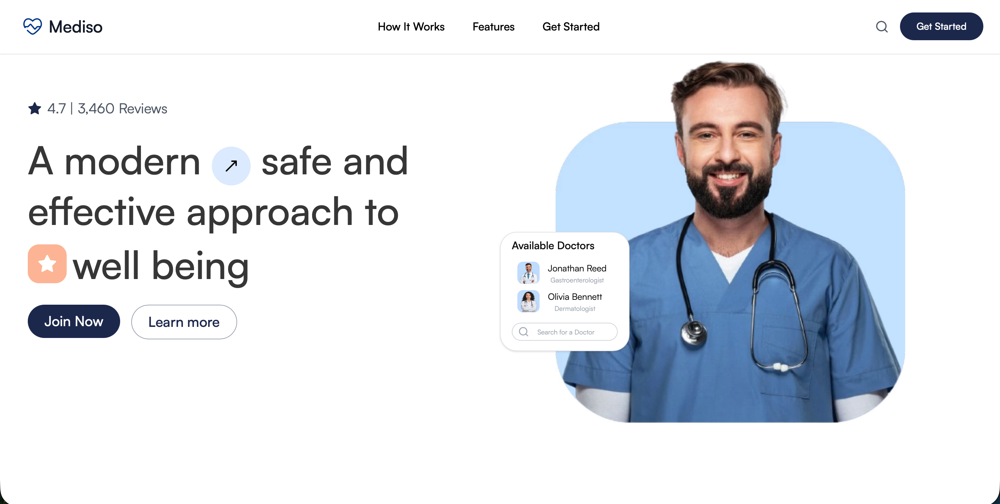

<h1 align="center">Mediso</h1>



## A platform for patients to share health concerns, upvote issues, and connect with doctors for personalized support. Doctors review submissions and choose the issues that they can address and have successfully treated in the past, simplifying your healthcare journey without the need to juggle between multiple doctors.


## Development

### Setup

#### Manual Setup

1. Clone the repo

```sh
git clone https://github.com/RiteshBhoskar/mediso.git
```

2. Go to the project folder

```sh
cd mediso
```

3. Install packages

```sh
npm install
```

4. Rename or duplicate `env.example` to `.env`

    - ```sh
        cp .env.example .env
        ```

    - Use `openssl rand -base64 32` to generate a key and add it under `NEXTAUTH_SECRET` in the `.env` file.

    - Use `openssl rand -base64 32` to generate a key and add it under `JWT_SECRET` in the `.env` file.

    - Add you database url under `DATABASE_URL`

    - Add the same database url in wss-server `.env`


5. Migrate the db

```sh
npx prisma migrate dev
```


6. Seed the db

```sh
npx prisma seed
```

7. Generate the prisma client for websocket repo

```sh
cd wss-server
```

```sh
npx prisma generate
```

8. Start the websocket server

```sh
npm run dev
```

9. Run the Next Project

```sh
cd ..
npm run dev
```

### Docker Setup

1.  Clone The Repo

```sh
git clone https://github.com/RiteshBhoskar/mediso.git
```

2. Switch to project folder

```sh
cd mediso
```

3. Pull images

```sh
make pull
```

4. Rename or duplicate `env.example` to `.env`

    - ```sh
        cp .env.example .env
        ```

    - Use `openssl rand -base64 32` to generate a key and add it under `NEXTAUTH_SECRET` in the `.env` file.

    - Use `openssl rand -base64 32` to generate a key and add it under `JWT_SECRET` in the `.env` file.


4. Run docker compose

```sh
make up
```

Visit the website on localhost:3000